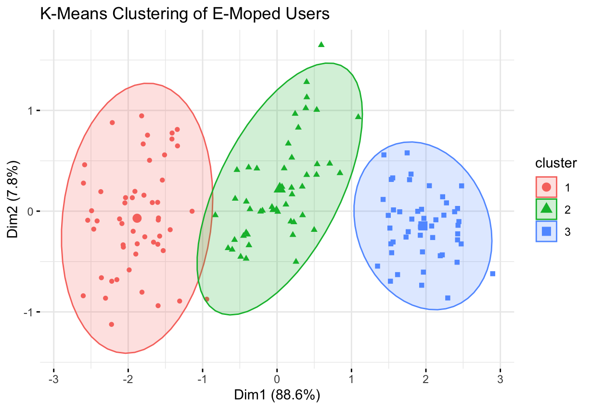
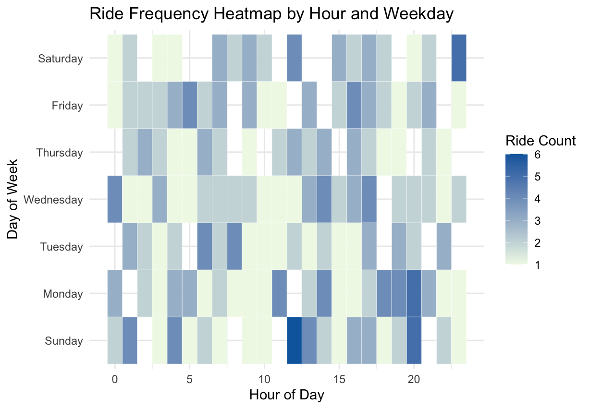

# 🛵 Shared E-Moped Usage Analysis (Google Data Analytics Capstone)

This is a capstone project for the [Google Data Analytics Certificate](https://www.coursera.org/professional-certificates/google-data-analytics), focusing on analyzing simulated usage data from a shared electric moped system in a Chinese city.

---

## 📌 Project Summary

- **Objective:** Identify user riding patterns to support decisions on fleet deployment, station optimization, and targeted marketing.
- **Tools Used:** R, SQL, Tableau, Excel, GitHub
- **Skills Demonstrated:** Data cleaning, SQL queries, clustering analysis, data visualization, dashboard design, and business insight development

---

## 🔍 Key Business Questions。 

- What are the peak riding hours for different user types?
- Which start and end stations are used most frequently?
- What routes are most common among all users?
- Do casual and subscriber users ride differently?
- How does ride duration vary across days of the week?

---

## 🛠️ Methodology (Google 6-Step Framework)

1. **Ask:** Defined business questions and key stakeholders
2. **Prepare:** Imported, explored, and validated raw ride data
3. **Process:** Cleaned missing values, standardized formats, removed outliers
4. **Analyze:** Explored usage patterns across users, time, and location
5. **Share:** Built an interactive dashboard in Tableau and GitHub-hosted analysis
6. **Act:** Provided actionable recommendations for scheduling and marketing

---

## 📊 Tableau Dashboard

The interactive dashboard visualizes ride behavior by user type, station usage, and ride patterns across days.

👉 [View Interactive Dashboard](https://public.tableau.com/app/profile/hui.wang3308/viz/E-MopedUsageAnalysisCapstoneforGoogleDataAnalytics/SharedE-MopedUsageDashboard)

This dashboard was created as part of the Google Data Analytics Capstone to communicate business-facing insights. SQL and R were used for supplementary modeling and analysis.

---

## 📂 File Structure

shared-e-moped-china/
├── sql/
│ └── e_moped_analysis.sql # SQL queries for exploratory data analysis
├── cluster_analysis/
│ ├── user_clustering.R # R script for K-means clustering
│ └── ride_heatmap.R # R script for hourly-weekday heatmap
├── visualizations/
│ ├── kmeans_cluster.png # Output of R clustering
│ └── ride_heatmap.png # Output of ride time heatmap
├── README.md

---

## 🧠 SQL Analysis Module

A set of SQL queries was created to simulate real-world exploration of e-moped user behavior, including:

- Average ride duration by user type
- Most popular start stations
- Peak hourly ride periods
- Weekend vs. weekday usage comparison

📄 Code: [`sql/e_moped_analysis.sql`](./sql/e_moped_analysis.sql)

---

## 🔬 R Clustering Analysis

K-Means clustering was applied to segment users based on:

- Average ride duration  
- Weekly ride frequency  
- Weekend ride ratio  

📄 Code: [`cluster_analysis/user_clustering.R`](./cluster_analysis/user_clustering.R)

### 📈 Clustering Output:

---

## 🕒 Time-Based Ride Heatmap

To identify peak riding times across the week, a heatmap was created using simulated ride timestamps.

📄 Code: [`cluster_analysis/ride_heatmap.R`](./cluster_analysis/ride_heatmap.R)

### 📊 Heatmap Output:

---

## 💡 Key Insights

- **Peak Usage:** Weekday commuting hours (8–9 AM, 5–7 PM)
- **User Segments:** Casual users tend to ride on weekends with shorter durations, while subscribers are high-frequency weekday users
- **Station Popularity:** Business districts and metro stations dominate start/end points
- **Recommendation:** Improve bike availability during weekday peaks and promote subscriptions to weekend users

---

## 🧭 Next Steps

- Add real-world geospatial mapping using `leaflet` or Tableau maps
- Extend SQL queries to calculate retention, user churn, and lifetime value
- Apply DBSCAN or hierarchical clustering as alternatives to K-Means

---

## 📬 Contact

Made with 💡 by Hui Wang  
🔗 [LinkedIn](https://www.linkedin.com/in/hazelnuthui) ｜ [GitHub Portfolio](https://github.com/HazelnutHui)
